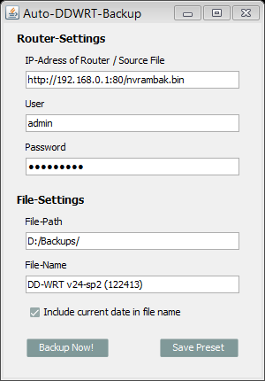

Auto-DDWRT-Backup
=================

This program connects through http with your DD-WRT router using credentials you provide.
It will pull the config-backup of your router (nvrambak.bin) and save it locally on your harddisk.

How to use
----------------------------
1. Download [here](https://github.com/AllTernative90/Auto-DDWRT-Backup/releases/tag/1.0)
2. run the program
3. enter router settings and the path to save the backup to
4. hit the "backup now" button

The backup file will be pulled from your router and saved according to the path in ISettings.java.

You can obviously compile it yourself if you wish.

Features to be added
----------------------------
I plan on adding these features:  
-check if file already exists  
-handle file exists issues  

Dependencies
----------------------------
For encoding base64 I used the apache commons codec library, which I already included in the project.

Used resources (amongst others)
----------------------------
http://stackoverflow.com/questions/469695/decode-base64-data-in-java  
http://stackoverflow.com/questions/921262/how-to-download-and-save-a-file-from-internet-using-java
